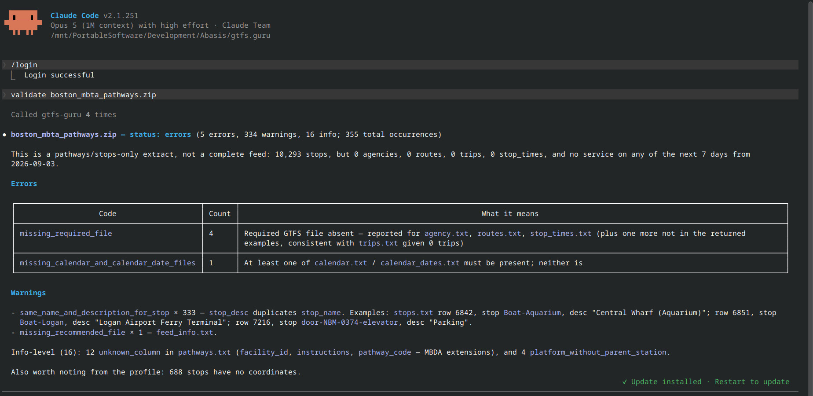

<div align="center">


# GTFS Guru

**A fast, native, multi-platform GTFS validator.**

[](https://github.com/abasis-ltd/gtfs.guru/actions)
[](LICENSE)
[](https://crates.io/crates/gtfs-guru)
[](https://pypi.org/project/gtfs-guru/)

</div>

---

GTFS Guru checks your transit data for errors before it goes live on Google
Maps, Apple Maps, or any other journey planner — 110 validators over your
schedules, routes, stops, fares, and shapes, in seconds, on your own machine.

> [!NOTE]
> Inspired by [MobilityData/gtfs-validator](https://github.com/MobilityData/gtfs-validator).
> We rebuilt the validation logic from the ground up in Rust for speed, privacy,
> and portability. The report shape and notice codes are closely compatible; the
> rule sets are not identical.

## Table of contents

- 🚀 [Getting Started](#getting-started)
- ⭐ [Why GTFS Guru](#why-gtfs-guru)
- ⚙️ [Installation](#installation)
- 📝 [Usage Examples](#usage-examples)
  - [CLI](#cli)
  - 🖥️ [Desktop](#desktop)
  - 🤖 [MCP server](#mcp-server)
  - 🌐 [Web](#web)
- ⚡ [Performance](#performance)
- 📕 [Documentation](#documentation)
- 🔎 [Contributing](#contributing)
- 📜 [License](#license)

## Getting Started

[Try it in your browser](https://gtfs.guru)

[Documentation](https://abasis-ltd.github.io/gtfs.guru/)

[Download](https://github.com/abasis-ltd/gtfs.guru/releases/latest)

## Why GTFS Guru?

- **Fast native engine** — parallel CSV loading keeps even 16-million-row feeds in the seconds range, with no JVM startup cost.
- **Private by default** — runs locally. Pre-release schedules never leave your machine.
- **Everywhere you work** — desktop app, CLI, Python library, Web API, WebAssembly, and an MCP server for LLM clients.
- **Built for CI** — SARIF, JSON, and HTML reports, status badges, exit codes, and a ready-made GitHub Action.
- **Deep coverage** — 110 validators, optional Google-specific rules, and a `--thorough` mode.
- **Fixes, not just complaints** — `--fix` writes a repaired copy of the feed and validates it again.

| | Java Validator | GTFS Guru |
| :--- | :--- | :--- |
| **Speed** | JVM startup + Java pipeline | Native binary, [4.6–6.7× faster](docs/benchmarks.md) |
| **Memory** | 🐘 Heavy (JVM) | 🪶 Light (native) |
| **Platform** | Java runtime required | Standalone binary |
| **Python** | Wrapper only | Native (`pip install`) |
| **Browser** | Server-side only | Browser-native (WASM) |
| **CI output** | — | SARIF + JSON/HTML + badges |

## Installation

**Desktop app** — download the installer for macOS, Windows, or Linux from the
[releases page](https://github.com/abasis-ltd/gtfs.guru/releases/latest), then
drag your `gtfs.zip` onto the window. No command line involved.

**Command line** — macOS and Linux:

```bash
curl -fsSL https://raw.githubusercontent.com/abasis-ltd/gtfs.guru/main/scripts/install.sh | bash
```

Windows PowerShell:

```powershell
iwr -useb https://raw.githubusercontent.com/abasis-ltd/gtfs.guru/main/scripts/install.ps1 | iex
```

**Python** — for notebooks and ETL pipelines (Python 3.8+):

```bash
pip install gtfs-guru
```

Also available with `cargo install gtfs-guru`. Every platform archive, the
installer's environment variables, and building from source are in the
[installation guide](docs/installation.md).

## Usage Examples

### CLI

```bash
# Validate a feed; writes report.json, report.html, and system_errors.json
gtfs-guru -i gtfs.zip -o ./report

# Validate straight from a URL
gtfs-guru -u https://example.com/gtfs.zip -o ./report

# Fail a CI job on any error, and hand SARIF to your code scanner
gtfs-guru -i gtfs.zip -o ./report --fail-on error --sarif gtfs.sarif.json

# See what a repair would change, then write a fixed copy
gtfs-guru -i gtfs.zip -o ./report --fix-dry-run
gtfs-guru -i gtfs.zip -o ./report --fix

# Compare a feed update and fail on new errors
gtfs-guru diff old.zip new.zip --fail-on-new-errors
```

```python
import gtfs_guru

report = gtfs_guru.validate("gtfs.zip")
print(f"Valid: {report.is_valid}, notices: {len(report.notices)}")
report.save_html("validation_report.html")
```

Validate on every push with the bundled GitHub Action:

```yaml
- uses: actions/checkout@v4
- uses: abasis-ltd/gtfs.guru/action@v1
  with:
    feed: feed.zip
    fail-on: error
```

Full option list, subcommands, badges, and CI recipes: [**usage guide**](docs/usage.md).

### Desktop


### MCP server



### Web


## Performance

Apple M3 Pro, warm page cache, each tool writing its normal report files:

| Feed | `stop_times.txt` rows | `gtfs.guru` | `gtfsvtor` 1.0.3 | canonical `gtfs-validator` 8.0.1 |
| :--- | ---: | ---: | ---: | ---: |
| MBTA Boston | 5.4M | **2.32 s** | 6.13 s | 10.60 s |
| OVapi NL | 16.0M | **9.75 s** | 21.66 s | 65.18 s |

Setup, caveats, and commands to reproduce: [**benchmarks**](docs/benchmarks.md).

## Documentation

| Guide | What's in it |
| --- | --- |
| [Installation](docs/installation.md) | Every platform, installer flags, building from source |
| [Usage](docs/usage.md) | CLI options, `diff` / `profile` / `explain`, exit codes, badges, CI |
| [Benchmarks](docs/benchmarks.md) | Method, numbers, and how to reproduce them |
| [LLM Guide](docs/llm.md) | Compact copy/paste reference and the MCP server |
| [Python API](docs/python_api.md) | The `gtfs_guru` module |
| [Validation Rules](docs/rules.md) | Every notice code the 110 validators emit |
| [Browser (WASM)](docs/wasm.md) | Running the validator client-side |

## Contributing

Contributions are very welcome — new rules, bug fixes, documentation.

```bash
git clone https://github.com/abasis-ltd/gtfs.guru
cd gtfs.guru
cargo test --workspace
```

You will need [Rust](https://rustup.rs); on Linux, also the
[system dependencies](docs/system-dependencies.md). See
[CONTRIBUTING.md](CONTRIBUTING.md) for the project layout, the review workflow,
and the style guide, and [CODE_OF_CONDUCT.md](CODE_OF_CONDUCT.md) for community
expectations.

Found a security issue? Please follow [SECURITY.md](SECURITY.md) rather than
opening a public issue.

## License

[Apache-2.0](LICENSE). Free to use for everyone.
